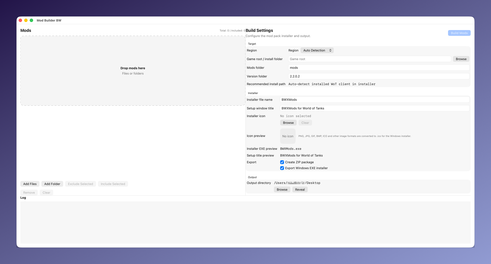

# Mod Builder BW

Mod Builder BW is a cross-platform World of Tanks mod pack builder for macOS and Windows.

It helps mod creators collect multiple `.wotmod` files or folders, target a specific game version, and export the final package as either a ZIP archive or a Windows MSI installer. The generated Windows installer launches the bundled mod deployment payload and can auto-detect installed World of Tanks clients for EU, NA, RU, and generic installations before installing the mods.

## What The Software Does

- builds mod packs from multiple files or folders
- supports drag and drop mod input
- targets a specific `mods/<version>` folder structure
- creates ZIP packages for distribution
- creates Windows MSI installers for mod deployment
- supports custom installer name, setup title, and icon
- auto-detects installed World of Tanks clients on Windows
- includes native app targets for macOS and Windows

## Project Targets

- `src/` : Java 21 version
- `native/macos/` : native Swift macOS app
- `native/windows/` : native .NET 10 WPF Windows app

## Branding Assets

- `branding/ModBuilderBW.png`
- `branding/ModBuilderBW.ico`
- `branding/ModBuilderBW.icns`

## Current Release Outputs

- macOS: `.app` and `.dmg`
- Windows: native installer `.msi`

## Building The Windows MSI

- On Windows: run `native/windows/build_windows_installer.py`
- On macOS: push your branch, then run `native/windows/build_windows_msi_via_github.sh`

The macOS helper triggers the GitHub Actions `Release` workflow on a Windows runner, waits for it to finish, and downloads the produced `ModBuilderBW-Windows-Installer.msi` back to your Mac.

## Publish To GitHub Desktop

1. Open GitHub Desktop.
2. `File` -> `Add Local Repository`.
3. Select:
   - `/Users/amarkovic/Desktop/Mod Builder/Bilder/Mod Billder`
4. Click `Publish repository`.
5. Suggested repository name:
   - `ModBuilderBW`
6. Set visibility to `Public`.
7. Publish.

## GitHub Actions Release

The repository includes:
- `.github/workflows/release.yml`
- `scripts/release/sign_windows.ps1`
- `native/macos/build_dmg.sh`

What the workflow does:
- builds macOS `.app` and `.dmg`
- builds Windows native installer `.msi`
- signs artifacts if certificate secrets are present
- uploads build artifacts to GitHub Actions

## macOS Warning-Free Distribution

To avoid Gatekeeper warnings you need:
- Apple Developer Program membership
- `Developer ID Application` certificate
- notarization with Apple

Required GitHub secrets for signed macOS release:
- `APPLE_CERTIFICATE_P12_BASE64`
- `APPLE_CERTIFICATE_PASSWORD`
- `APPLE_KEYCHAIN_PASSWORD`
- `APPLE_ID`
- `APPLE_APP_SPECIFIC_PASSWORD`
- `APPLE_TEAM_ID`
- `MACOS_SIGN_IDENTITY`

Without these, macOS builds are still generated, but they are not fully trusted by Gatekeeper.

## Windows Warning-Free Distribution

To reduce or remove SmartScreen warnings you need a real code-signing certificate.

Recommended:
- EV Authenticode certificate

Supported workflow secrets:
- `WINDOWS_CERTIFICATE_PFX_BASE64`
- `WINDOWS_CERTIFICATE_PASSWORD`
- or `WINDOWS_CERTIFICATE_THUMBPRINT`
- optional: `WINDOWS_TIMESTAMP_URL`

Without a real certificate, Windows installers still build, but SmartScreen can still warn.

## License

MIT. See `LICENSE`.
